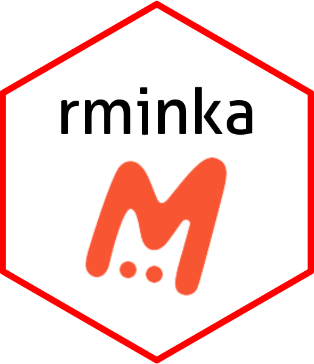

<!-- README.md is generated from README.Rmd. Please edit that file -->

```{r setup, include = FALSE}
knitr::opts_chunk$set(
  echo = TRUE,
  collapse = FALSE,
  comment = "#>"
)
```

```{r carga, include=FALSE}
library(dplyr)
library(minkar)
library(jsonlite)
library(httr)
library(leaflet)
library(magick)
```

# rminka <a href="https://ggplot2.tidyverse.org"></a>


## About

`rminka` is a wrapper for Minka APIs for accessing the observations.


## Installation

The easiest way to get `rminka` is to install from github repository:

```{r introduction, include = TRUE , echo=TRUE}
# devtools::install_github("development_biomarine/rminka")
```

## Quickstart guide

### Get observations

`get_minka_obs()` This function retrieves observations from Minka. The text or taxon search can be refined by observation date, record quality and location.

> It is recommended to set the `quality` argument to `"research"` in order to get more reliable data that has been validated by several contributors.

#### Fuzzy search

You can search for observations by either common or scientific name. It will search the entire  database, so the search below will return entries that _mention_ seabream fishes , not just seabream observations.


```{r search0, include = TRUE , echo=TRUE}
sard <- get_minka_obs(query = "seabream", year = 2021)

unique(sard$scientific_name)
```


> Note that `get_minka_obs()` will return 500 observations by default. This can be controlled with the `maxresults` argument.

```{r search1, include = TRUE , echo=TRUE}

#Geting the first 10 observations using the parameter "maxresults = 10"

sard_max_results <- get_minka_obs(query = "seabream", year = 2021, maxresults = 10)

sard_max_results[,1:6]
```


#### Taxon search

To return only records of a specific species or taxonomic group, use the `taxon_name` argument. For example, to return observations of anything from the  family, and restricting the search to the year 2015:


```{r search2, include = TRUE , echo=TRUE}

#Geting al the Sparidae observations for the year 2022

sparidae <- get_minka_obs(taxon_name  = "Sparidae", year = 2022)

# how many unique taxa?

length(unique(sparidae$scientific_name))

#The species are:

unique(sparidae$scientific_name)
```

And to return only the seabream fish observations that also mention the term "banc":


```{r search3, include = TRUE , echo=TRUE}
sard_banc <- get_minka_obs(taxon_name = "Diplodus", query = "banc")

#number of Diplodus taxon observations with the term "banc"

count_sard <- nrow(sard_banc)

count_sard

#the observarions are

sard_banc[1:count_sard,1:2]

```


#### Bounding box search

You can also search within a bounding box by giving a simple set of coordinates.
The set of coordinates are defined by c( min Long, min Lat, max Long, max Lat)
 
```{r search4, include = TRUE , echo=TRUE, fig.cap = "Map of Salpa salpa observations"}
## Search by area Piscines Forum

bounds_forum <- c(41.407281, 2.224977, 41.409892, 2.228652 )

diplodus_forum <- get_minka_obs(query = "Diplodus sargus", bounds = bounds_forum, year = 2024, month = 5, maxresults = 7)

diplodus_forum[1,1:6]
```   
#The representation using leaflet

```{r search9, include = FALSE , echo=TRUE}
leaflet() %>%
  addTiles() %>%
  setView(lng = -3.7, lat = 40.4, zoom = 5) %>%
  addMarkers(lng = -3.7, lat = 40.4)
```  
 # leaflet() %>%
 #         addTiles() %>%
  #        setView(lng = 41.408492 , lat = 2.226725 , zoom = 15) # %>%
          #addRectangles(lng1 = 41.407281, lat1 = 2.224977,
          #lng2 = 41.409892, lat2 = 2.228652) #%>%
          #addMarkers(lng = as.double(diplodus_forum$longitude), lat = as.double(diplodus_forum$latitude) ,group = "Markers")
    

### Other functions

#### Get information and observations by project

You can get all the observations for a project if you know its ID or name as an Minka slug.


```{r search5, include = TRUE , echo=TRUE}
## Just get info about a project
urbamar <- get_minka_obs_project("urbamarbio", type = "info", raw = FALSE)
urbamar$project_observations_count
```


```{r search6, include = TRUE , echo=TRUE, message=TRUE}
## Now get all the observations for that project
urbamar_obs <- get_minka_obs_project("biodiversitat-marina-de-les-platges-de-sant-adria-del-besos", type = "observations")

#Geting the first 5 observations

urbamar_obs[1:5,8:1]
```


#### Get observation details

Detailed information about a specific observation can be retrieved by observation ID. The easiest way to get the ID is from a previous search for that taxon.


```{r search7, include = TRUE , echo=TRUE}
ident <- sard_banc$id[1]

ident

#get_minka_obs_id(ident)[1:4,1:5]
```


#### Get all observations by user

If you just want all the observations by a user you can download all their observations by user ID. A word of warning though, this can be quite large (easily into the 1000's).


```{r search8, include = TRUE , echo=TRUE}

user_obs <- get_minka_obs_user('ramonservitje')

(user_obs)[1:5,1:3]

#it is possible to view the images with the links in Minka

#url <- user_obs$image_url[412]

# Read the image
#image <- image_read(url)


# Show the image
#print(image, info = 'Observation of user rramonservitje')
```
