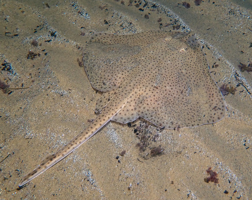

<!-- README.md is generated from README.Rmd. Please edit that file -->

# rminka <a href="https://ggplot2.tidyverse.org"></a>

## About

`rminka` is a wrapper for Minka APIs for accessing the observations.

## Installation

The easiest way to get `rminka` is to install from github repository:

``` r
# devtools::install_github("development_biomarine/rminka")
```

## Quickstart guide

### Get observations

`get_minka_obs()` This function retrieves observations from Minka. The
text or taxon search can be refined by observation date, record quality
and location.

> It is recommended to set the `quality` argument to `"research"` in
> order to get more reliable data that has been validated by several
> contributors.

#### Fuzzy search

You can search for observations by either common or scientific name. It
will search the entire database, so the search below will return entries
that *mention* seabream fishes , not just seabream observations.

``` r
sard <- get_minka_obs(query = "seabream", year = 2021)

unique(sard$scientific_name)
```

    #>  [1] "Lithognathus mormyrus"   "Sparidae"               
    #>  [3] "Diplodus sargus"         "Diplodus annularis"     
    #>  [5] "Diplodus vulgaris"       "Oblada melanura"        
    #>  [7] "Diplodus puntazzo"       "Sparus aurata"          
    #>  [9] "Pagellus bogaraveo"      "Diplodus cadenati"      
    #> [11] "Pagellus acarne"         "Spondyliosoma cantharus"
    #> [13] "Pagrus caeruleostictus"  "Pagrus auriga"

> Note that `get_minka_obs()` will return 500 observations by default.
> This can be controlled with the `maxresults` argument.

``` r
#Geting the first 10 observations using the parameter "maxresults = 10"

sard_max_results <- get_minka_obs(query = "seabream", year = 2021, maxresults = 10)

sard_max_results[,1:6]
```

    #>          scientific_name                  datetime description
    #> 1  Lithognathus mormyrus 2021-10-03 11:55:00 +0200            
    #> 2               Sparidae 2021-10-03 11:55:00 +0200            
    #> 3        Diplodus sargus 2021-08-05 13:23:00 +0200            
    #> 4     Diplodus annularis 2021-08-04 11:19:00 +0200            
    #> 5        Diplodus sargus 2021-08-03 15:19:00 +0200            
    #> 6      Diplodus vulgaris 2021-08-03 15:19:00 +0200            
    #> 7        Oblada melanura 2021-08-03 15:13:00 +0200            
    #> 8      Diplodus vulgaris 2021-07-28 08:51:00 +0200            
    #> 9        Oblada melanura 2021-07-25 12:10:00 +0200            
    #> 10       Diplodus sargus 2021-07-04 09:52:00 +0200            
    #>          place_guess latitude longitude
    #> 1  Barcelona, España 41.26480  2.005203
    #> 2  Barcelona, España 41.26480  2.005200
    #> 3              Spain 40.05483  3.883954
    #> 4              Spain 39.95923  4.265633
    #> 5                    39.93600  3.937817
    #> 6                    39.93600  3.937833
    #> 7                    39.93646  3.938442
    #> 8                    41.08978  1.228733
    #> 9                    41.08981  1.228671
    #> 10                   41.08979  1.228717

#### Taxon search

To return only records of a specific species or taxonomic group, use the
`taxon_name` argument. For example, to return observations of anything
from the family, and restricting the search to the year 2015:

``` r
#Geting al the Sparidae observations for the year 2022

sparidae <- get_minka_obs(taxon_name  = "Sparidae", year = 2022)

# how many unique taxa?

length(unique(sparidae$scientific_name))
```

    #> [1] 20

``` r
#The species are:

unique(sparidae$scientific_name)
```

    #>  [1] "Pagrus pagrus"           "Diplodus cervinus"      
    #>  [3] "Diplodus vulgaris"       "Oblada melanura"        
    #>  [5] "Diplodus puntazzo"       "Diplodus sargus"        
    #>  [7] "Sparus aurata"           "Lithognathus mormyrus"  
    #>  [9] "Sarpa salpa"             "Boops boops"            
    #> [11] "Dentex dentex"           "Pagellus acarne"        
    #> [13] "Pagellus erythrinus"     "Dentex gibbosus"        
    #> [15] "Spondyliosoma cantharus" "Sparidae"               
    #> [17] "Pagrus auriga"           "Diplodus annularis"     
    #> [19] "Diplodus"                "Diplodus cadenati"

And to return only the seabream fish observations that also mention the
term “banc”:

``` r
sard_banc <- get_minka_obs(taxon_name = "Diplodus", query = "banc")

#number of Diplodus taxon observations with the term "banc"

count_sard <- nrow(sard_banc)

count_sard
```

    #> [1] 4

``` r
#the observarions are

sard_banc[1:count_sard,1:2]
```

    #>     scientific_name                  datetime
    #> 1 Diplodus vulgaris 2018-07-26 00:00:00 +0100
    #> 2 Diplodus vulgaris 2018-07-26 00:00:00 +0100
    #> 3 Diplodus vulgaris 2018-07-04 00:00:00 +0100
    #> 4 Diplodus vulgaris 2019-07-21 00:00:00 +0100

#### Bounding box search

You can also search within a bounding box by giving a simple set of
coordinates. The set of coordinates are defined by c( min Long, min Lat,
max Long, max Lat)

``` r
## Search by area Piscines Forum

bounds_forum <- c(41.407281, 2.224977, 41.409892, 2.228652 )

diplodus_forum <- get_minka_obs(query = "Diplodus sargus", bounds = bounds_forum, year = 2024, month = 5, maxresults = 7)

diplodus_forum[1:3,1:6]
```

    #>   scientific_name                  datetime description
    #> 1 Diplodus sargus 2024-05-18 11:40:00 +0200          NA
    #> 2 Diplodus sargus 2024-05-18 10:11:00 +0200          NA
    #> 3 Diplodus sargus 2024-05-24 10:23:00 +0200          NA
    #>                               place_guess latitude longitude
    #> 1                                   Forum 41.40921  2.227122
    #> 2                                   Forum 41.40921  2.227122
    #> 3 El Besòs i el Maresme, Barcelona, Spain 41.40882  2.227477

\#The representation using leaflet

``` r
leaflet::leaflet() %>%
  addTiles() %>%
  setView(lng = -3.7, lat = 40.4, zoom = 5)
```

<div class="leaflet html-widget html-fill-item" id="htmlwidget-099690d15201754179dd" style="width:672px;height:480px;"></div>
<script type="application/json" data-for="htmlwidget-099690d15201754179dd">{"x":{"options":{"crs":{"crsClass":"L.CRS.EPSG3857","code":null,"proj4def":null,"projectedBounds":null,"options":{}}},"calls":[{"method":"addTiles","args":["https://{s}.tile.openstreetmap.org/{z}/{x}/{y}.png",null,null,{"minZoom":0,"maxZoom":18,"tileSize":256,"subdomains":"abc","errorTileUrl":"","tms":false,"noWrap":false,"zoomOffset":0,"zoomReverse":false,"opacity":1,"zIndex":1,"detectRetina":false,"attribution":"&copy; <a href=\"https://openstreetmap.org/copyright/\">OpenStreetMap<\/a>,  <a href=\"https://opendatacommons.org/licenses/odbl/\">ODbL<\/a>"}]}],"setView":[[40.4,-3.7],5,[]]},"evals":[],"jsHooks":[]}</script>

leaflet() %\>% addTiles() %\>% \# setView(lng = 41.408492 , lat =
2.226725 , zoom = 15) \# %\>% \#addRectangles(lng1 = 41.407281, lat1 =
2.224977, \#lng2 = 41.409892, lat2 = 2.228652) \#%\>% \#addMarkers(lng =
as.double(diplodus_forum \#longitude), lat =
as.double(diplodus_forum\$latitude) ,group = “Markers”)

### Other functions

#### Get information and observations by project

You can get all the observations for a project if you know its ID or
name as an Minka slug.

``` r
## Just get info about a project
urbamar <- get_minka_obs_project("urbamarbio", type = "info", raw = FALSE)
urbamar$project_observations_count
```

    #> [1] 55929

``` r
## Now get all the observations for that project
urbamar_obs <- get_minka_obs_project("biodiversitat-marina-de-les-platges-de-sant-adria-del-besos", type = "observations")
```

    #> Getting records 0-200

    #> Getting records up to 400

    #> Getting records up to 600

    #> Getting records up to 800

    #> Getting records up to 1000

    #> Getting records up to 1200

    #> Done.

``` r
#Geting the first 5 observations

urbamar_obs[1:5,8:1]
```

    #>         species_guess timeframe map_scale    longitude      latitude
    #> 1        Rabosa groga        NA        NA 2.2384089231 41.4250151953
    #> 2   Bavosa de plomall        NA        NA 2.2384089231 41.4250151953
    #> 3             Morruda        NA        NA 2.2384089231 41.4250151953
    #> 4 Limaria tuberculata        NA        NA 2.2384089231 41.4250151953
    #> 5             Variada        NA        NA 2.2384089231 41.4250151953
    #>   description observed_on     id
    #> 1        <NA>  2024-09-10 354734
    #> 2        <NA>  2024-09-10 354735
    #> 3        <NA>  2024-09-10 354736
    #> 4        <NA>  2024-09-10 354737
    #> 5        <NA>  2024-09-10 354738

#### Get observation details

Detailed information about a specific observation can be retrieved by
observation ID. The easiest way to get the ID is from a previous search
for that taxon.

``` r
ident <- sard_banc$id[1]

ident
```

    #> [1] 80229

``` r
#get_minka_obs_id(ident)[1:4,1:5]
```

#### Get all observations by user

If you just want all the observations by a user you can download all
their observations by user ID. A word of warning though, this can be
quite large (easily into the 1000’s).

``` r
user_obs <- get_minka_obs_user('ramonservitje')

(user_obs)[1:5,1:3]
```

    #>        scientific_name                  datetime description
    #> 1  Porphyrio porphyrio 2024-11-10 12:03:00 +0100            
    #> 2   Podiceps cristatus 2024-11-10 13:21:00 +0100            
    #> 3   Circus aeruginosus 2024-11-10 13:32:00 +0100            
    #> 4 Podiceps nigricollis 2024-11-10 13:48:00 +0100            
    #> 5    Pelophylax perezi 2024-11-09 12:10:00 +0100

``` r
#it is possible to view the images with the links in Minka

url <- user_obs$image_url[412]

url
```

    #> [1] "https://minka-sdg.org/attachments/local_photos/files/135650/medium.jpeg"

``` r
# Read the image

image_url <- image_read(url)

#image <- paste('<p style="text-align:center"></p>')

#image

# Show the image

print(image_url, info = 'Observation of user rramonservitje')
```


